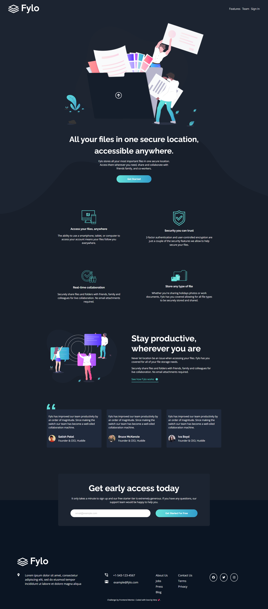

# Frontend Mentor - Fylo dark theme landing page solution

This is a solution to the [Fylo dark theme landing page challenge on Frontend Mentor](https://www.frontendmentor.io/challenges/fylo-dark-theme-landing-page-5ca5f2d21e82137ec91a50fd). Frontend Mentor challenges help you improve your coding skills by building realistic projects. 

### Screenshot

### Links

- Solution URL: [Add solution URL here](https://your-solution-url.com)
- Live Site URL: [https://verakissyou17.github.io/fylo-dark-theme-landing-page/]

## My process

### Built with

- Semantic HTML5 markup
- CSS custom properties
- Flexbox
- CSS Grid
- Mobile-first workflow
- [React](https://reactjs.org/) - JS library
- [Sass](https://sass-lang.com/) - For styles

## Author

- Website - [https://verakissyou.it.com]
- Frontend Mentor - [https://www.frontendmentor.io/profile/verakissyou17]
- LinkedIn - [https://www.linkedin.com/in/veronica-ciuc%C4%83-467003278/]

